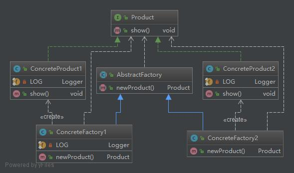
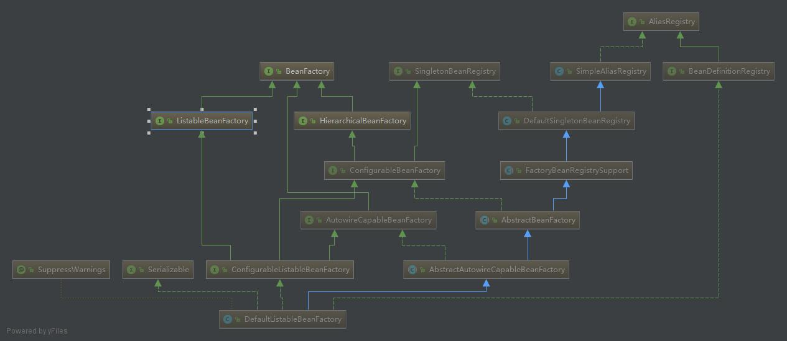

# 工厂方法模式(Factory Method)

## 概念
工厂方法模式通过定义工厂负责定义创建对象的公共接口，而子类则负责生成具体的对象。该模式主要由以下几个模块组成：
* 抽象产品(Product)：描述具体产品的接口
* 具体产品(Concrete Product)：描述生成的具体产品
* 抽象工厂(Abstract Factory)：描述具体工厂的接口
* 具体工厂(Concrete Factory)：描述具体工厂的实例

## 类图
工厂方法模式的类图如下所示：

--------------------------------------------

--------------------------------------------

## 应用实例
工厂方法模式在Java程序设计中是很常见的设计模式，各种产品都广泛使用了该设计模式。在此，我以Spring的BeanFactory介绍Spring中工厂方法模式的应用。
Spring框架通过IOC容器注入Bean的方式来管理Bean的依赖与实例。而对于创建Bean实例，Spring框架则提供了BeanFactory接口来完成，这个BeanFactory就是比较典型的工厂方法模式。Spring自定义的默认BeanFactory实现的类图如下图所示：

---------------------------------------------

---------------------------------------------

BeanFactory提供了多个getBean()方法用于获取Bean实例，Spring还提供了多个默认实现类实现BeanFactory接口。以XmlBeanFactory类为例，该类实现了通过XML实例化Bean的方式。
XmlBeanFactory继承自DefaultListableBeanFactory类，该类通过实现了一个ConfigurableListableBeanFactory接口来实现BeanFactory接口，从而实现生产Bean的工厂类，这样便实现了基于XML配置实例化Bean的方法。在DefaultListableBeanFactory类的实现中，可以发现在getBean()方法的实现中，可以通过一个ResolvableType来确定一个解析策略，而这种方式则使用了设计模式中的另外一种模式——策略模式，在此不详细介绍该模式。
